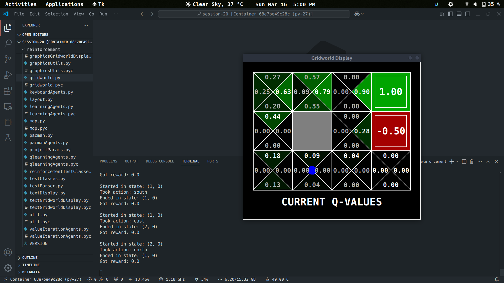

<h1 align="center">
  <b>Value Iteration method using Bellman equation</b>
</h1>

<p align="center">
  <a href="https://www.python.org/downloads/release/python-2718/">
    
  </a>
  <a href="https://www.python.org/downloads/release/python-31012/">
    
  </a>
</p>


# **Q-Learning [Python 2.7.18]**


### **QLearningAgent Class**
This is the core Q-learning agent that will be responsible for learning the optimal action-policy for the Pacman agent based on experiences gained from the environment.

#### Constructor (`__init__`):
```python
def __init__(self, **args):
    ReinforcementAgent.__init__(self, **args)
    self.qValues = util.Counter()
```
- In the constructor, `QLearningAgent` inherits from `ReinforcementAgent` (the base class).
- `self.qValues` is initialized as an empty `util.Counter` (a special dictionary-like object) to store Q-values (action-value pairs).

#### `getQValue`:
```python
def getQValue(self, state, action):
    return self.qValues[(state, action)]
```
- This function returns the Q-value for a given state-action pair. If it hasn't been encountered before, the `Counter` object will return `0.0` by default.

#### `computeValueFromQValues`:
```python
def computeValueFromQValues(self, state):
    legal_moves = self.getLegalActions(state)
    if len(legal_moves) == 0:
        return 0.0
    best_action = self.getPolicy(state)
    return self.getQValue(state, best_action)
```
- This method computes the value of the state (the expected return from the best action, given the current Q-values).
- If there are no legal actions (terminal state), it returns `0.0`.

#### `computeActionFromQValues`:
```python
def computeActionFromQValues(self, state):
    legal_moves = self.getLegalActions(state)
    best_action = None
    max = float('-inf')
    for move in legal_moves:
        qValue = self.qValues[(state, move)]
        if qValue > max:
            max = qValue
            best_action = move
    return best_action
```
- This function computes the best action to take in a given state by selecting the action with the highest Q-value from the list of legal actions.
- If there are no legal actions, it returns `None`.

#### `getAction`:
```python
def getAction(self, state):
    legalActions = self.getLegalActions(state)
    action = None
    if len(legalActions) == 0:
        return None

    random_chance = util.flipCoin(self.epsilon)
    if random_chance:
        action = random.choice(legalActions)
    else:
        action = self.getPolicy(state)
    return action
```
- This method determines which action to take, using an epsilon-greedy policy.
  - With probability `epsilon`, it selects a random action (exploration).
  - Otherwise, it chooses the best action according to the policy (exploitation).

#### `update`:
```python
def update(self, state, action, nextState, reward):
    qValue = self.getQValue(state, action)
    first_term = (1 - self.alpha) * qValue
    qReward = self.alpha * reward
    if not nextState:
        self.qValues[(state, action)] = first_term + qReward
    else:
        nextState_term = self.alpha * self.discount * self.getValue(nextState)
        self.qValues[(state, action)] = first_term + qReward + nextState_term
```
- This method updates the Q-value based on the observed transition `(state, action) -> nextState, reward` using the Q-learning update rule.
  - `Q(s,a) = (1-alpha)*Q(s,a) + alpha*(R(s,a,s') + gamma * max(Q(s',a')))`.

#### `getPolicy` and `getValue`:
```python
def getPolicy(self, state):
    return self.computeActionFromQValues(state)

def getValue(self, state):
    return self.computeValueFromQValues(state)
```
- `getPolicy` returns the action with the highest Q-value (the best action).
- `getValue` returns the value of the state (the maximum Q-value for that state).


## **Visualization**

#### GridWorld



#### Pacman


# **Car Game [Python 3.10.12 | PyTorch 2.3 | [YouTube](https://youtu.be/01dkrN3CZL4)]**

## **City Map**


## **Mask**


### **Network Class**

- Adding 1 more Linear layer

```python
# Creating the architecture of the Neural Network
class Network(nn.Module):
    
    def __init__(self, input_size, nb_action):
        super(Network, self).__init__()
        self.input_size = input_size
        self.nb_action = nb_action
        self.fc1 = nn.Linear(input_size, 30)
        self.fc2 = nn.Linear(30, 10)
        self.fc3 = nn.Linear(10, nb_action)
    
    def forward(self, state):
        x = F.relu(self.fc1(state))
        x = F.relu(self.fc2(x))
        q_values = self.fc3(x)
        return q_values
```

- Alternate Goals to reach

```python
# Alternate between goals A1, A2, and A3
if distance < 25:
    if swap == 0:
        goal_x, goal_y = 1381, 622  # Goal A1
        swap = 1
    elif swap == 1:
        goal_x, goal_y = 288, 724  # Goal A2
        swap = 2
    else:
        goal_x, goal_y = 82, 70  # Goal A3
        swap = 0
```


## **Visualization**

#### Goal A1


#### Goal A3


